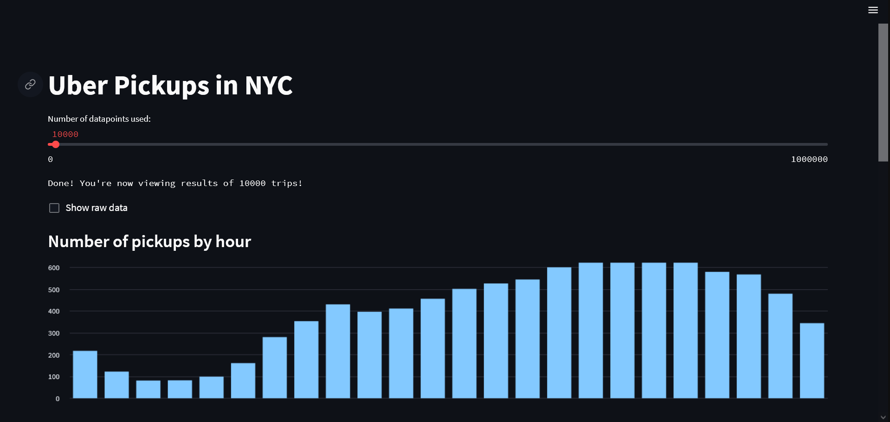
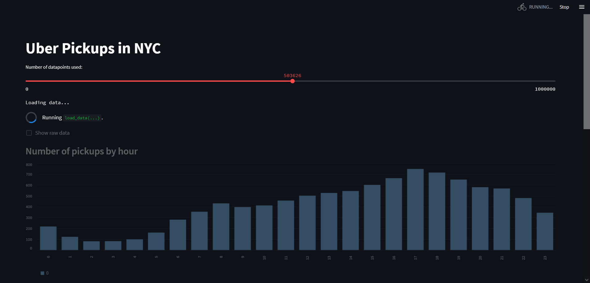
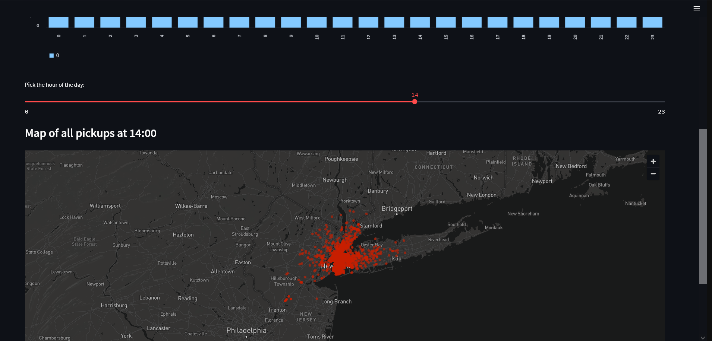

# Uber Pickups in NYC Streamlit App


#### Last Updated: August 7th, 2023

## Table of Contents

1. [Introduction](#introduction)
2. [Installation](#installation)
3. [Run](#run)
4. [License](#license)


<a name="introduction"></a>
## Introduction

Welcome to the Uber Pickups in NYC Streamlit App! This app visualizes Uber pickups data in New York City for the month of September 2014.
<br></br>

Experience full control over dataset visualization with a simple slider!

<br></br>

Furthermore, the app allows you to analyze Uber pickups based on the time of day. Use the slider to pinpoint the exact hour when Uber rides commenced. The app will then generate an insightful map visualization displaying all pickups during that specific hour and provide an in-depth view of Uber ride activity throughout the city.

<a name="installation"></a>
## Installation

Follow these steps to set up the environment and run the application:

1. Clone the Repository:
   
```bash
git clone https://github.com/Sambonic/Uber
```

```bash
cd Uber
```

2. Create a Python Virtual Environment:
```bash
python -m venv env
```

3. Activate the Virtual Environment:
- On Windows:
  ```
  env\Scripts\activate
  ```

- On macOS and Linux:
  ```
  source env/bin/activate
  ```

4. Install Dependencies:

```bash
pip install -r requirements.txt
```


<a name="run"></a>
## Run

To run the Streamlit app, execute the following command in the project directory after setting up the environment:

```bash
streamlit run uber_pickups.py
```

Once the app is running, you can interact with the following features:

- The slider allows you to select the number of data points used in the visualization.

- The "Show raw data" checkbox displays the raw data in a table.

- The slider "Pick the hour of the day" filters the data to display the map of all pickups at the selected hour.


<a name="license"></a>
## License

The MIT License (MIT)

This project is licensed under the MIT License - see the [LICENSE.md](Uber/LICENSE) file for details.

Permission is hereby granted, free of charge, to any person obtaining a copy of this software and associated documentation files (the "Software"), to deal in the Software without restriction, including without limitation the rights to use, copy, modify, merge, publish, distribute, sublicense, and/or sell copies of the Software, and to permit persons to whom the Software is furnished to do so, subject to the following conditions:

The above copyright notice and this permission notice shall be included in all copies or substantial portions of the Software.

THE SOFTWARE IS PROVIDED "AS IS," WITHOUT WARRANTY OF ANY KIND, EXPRESS OR IMPLIED, INCLUDING BUT NOT LIMITED TO THE WARRANTIES OF MERCHANTABILITY, FITNESS FOR A PARTICULAR PURPOSE, AND NONINFRINGEMENT. IN NO EVENT SHALL THE AUTHORS OR COPYRIGHT HOLDERS BE LIABLE FOR ANY CLAIM, DAMAGES, OR OTHER LIABILITY, WHETHER IN AN ACTION OF CONTRACT, TORT, OR OTHERWISE, ARISING FROM, OUT OF, OR IN CONNECTION WITH THE SOFTWARE OR THE USE OR OTHER DEALINGS IN THE SOFTWARE.

